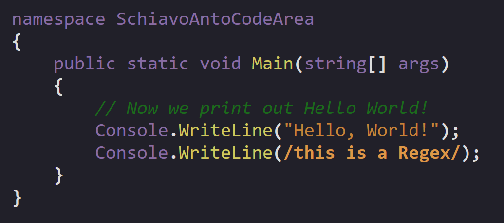
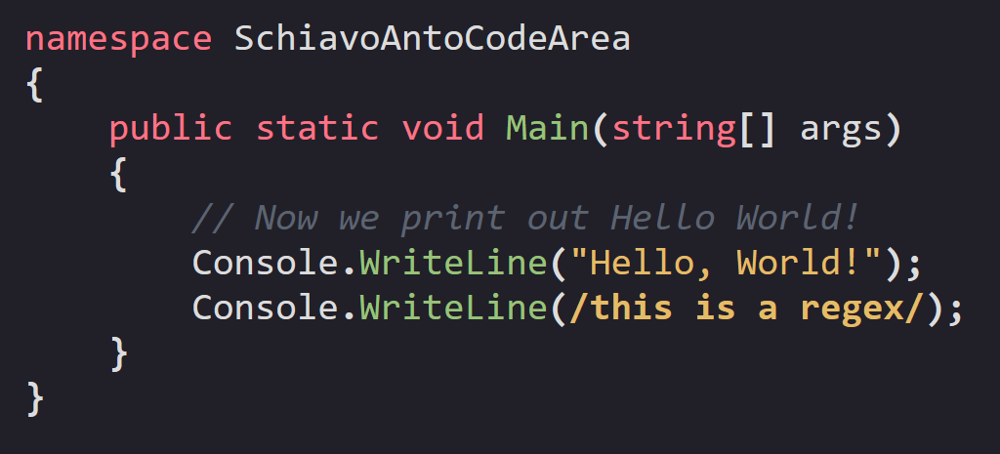

# SchiavoAnto's Code Area - Lightweight Code Editor Component

Client side JavaScript scripts and CSS files to create an interactive and live syntax highlighted code area, starting from a standard HTML `textarea` component.  
This project is based on [lrsjng/lolight](https://github.com/lrsjng/lolight).

## How to setup

Copy `SchiavoAnto-Code-Area-script.js` and `SchiavoAnto-Code-Area-style.css` in a folder of your choice.

In the HTML page you want to have the code area, include the script and the CSS file, like so:

```html
<script src="lib/SchiavoAnto-Code-Area-script.js" defer></script>
<link rel="stylesheet" href="lib/SchiavoAnto-Code-Area-style.css">
```

There is no guarantee that JS scripts will work without the `defer` attribute.  
Also, if you can `defer` your page script, great, otherwise it's recommended to create another script (with the `defer` attribute) just to setup the Code Area.

### Language support

Out of the box, there is generic support for all languages, meaning a single stylesheet and generic Regular Expressions to try to match most tokens of most languages.  



The default generic Regular Expressions are the same of lolight.  
To add support for a language, create a JavaScript file and a CSS file and include them in the HTML page, like so:

```html
<script src="lib/example/language-csharp.js" defer></script>
<link rel="stylesheet" href="lib/example/language-csharp.css">
```

The JavaScript file should contain two main things:  

1. Definition of an array of strings representing every possible language keyword;
2. An assignment to a variable called `TOKEN_RES`, setting its value to an array of arrays, each of which contains the type of token (declared in `SchiavoAnto-Code-Area-script.js`) to represent and the Regular Expression to match.  

For example, a script `language-csharp.js` could look like this:

```javascript
// Only part of the keywords, for example purposes.
// Changed only part of TOKEN_RES.
const keywords = ["abstract","as","base","bool","break","byte","case","catch"];
TOKEN_RES = [
    [NUMBER, /#([0-9a-f]{6}|[0-9a-f]{3})\b/],
    [COMMENT, /(\/\/|#).*?(?=\n|$)/],
    [COMMENT, /\/\*[\s\S]*?\*\//],
    [REGEX, /\/(\\\/|[^\n])*?\//],
    [STRING, /(['"`])(\\\1|[\s\S])*?\1/],
    [NUMBER, /[+-]?([0-9]*\.?[0-9]+|[0-9]+\.?[0-9]*)([eE][+-]?[0-9]+)?/],
    [FUNCALL, /([a-zA-Z_]\w*)\s*(?=\()/],
    [PARENTHESIS, /[\\.,:;+\-*\/=<>()[\]{}|?!&@~]/],
    [SPACE, /\s+/],
    [IDENTIFIER, /[\w$]+/],
    [UNKNOWN, /./],
];
```

The CSS stylesheet can include the classes you want; if you want to keep the default styling for certain tokens you can just omit that class.

For example, a stylesheet `language-csharp.css` could look like this:

```css
.code-comment {
    color: #5c6370;
    font-style: italic;
}

.code-keyword {
    color: #fb7385;
}

.code-identifier {
    color: unset;
}

.code-number {
    color: #ce95b8;
}

.code-brackets {
    font-weight: bold;
}

.code-regex {
    color: #e5bc66;
}

/* .code-space {} */

.code-string {
    color: #e5bc66;
}

.code-function-call {
    color: #98c379;
}

.code-unknown {
    text-decoration: dotted;
}
```

In this example I chose to override all classes, but you can for example do something like this:

```css
.code-keyword {
    color: #fb7385;
}

.code-function-call {
    color: #98c379;
}

.code-number {
    color: #ce95b8;
}
```

In this way, you override the styling for keywords, function calls and numbers, but the rest keeps the default styling.  

Using the example C# JavaScript file and the full CSS example, the result is this:  



## How to use

After optionally including language specific JavaScript and CSS, you can create your Code Area.

To create a Code Area, you can call the function `createCodeArea()`.  
This function takes these parameters:  
1. `parentCssSelector`, which should be a string representing a CSS3 selector of the element that will be containing the Code Area.
2. `defaultContent` (optional, default = `""`), which should be a string containing the default content of the textarea;
3. `additionalTextAreaAttributes` (optional, default = `""`), which should be a string representing additional HTML attributes to add to the raw `<textarea>` element;
4. `showLineNumbers` (optional, default = `false`), that specifies if the Code Area should have line numbers or not.

By default, the `<textarea>` element has these attributes set:  
`id="sa__editor" spellcheck="false" autocapitalize="false"`.

The main script will highlight the code every time it changes by calling the function `highlight()` on every textarea's `input` event.  

In your page script you can call the `highlight()` (`highlightAndUpdateLines()` to update line numbers too) function on the document's `DOMContentLoaded` event if you want to have the code highlighted on load, like this:

```html
<!DOCTYPE html>
    <head>
        <title>Example</title>
        <script src="pagescript.js" defer></script>
    </head>
    <body>
        
    </body>
</html>
```

```javascript
createCodeArea("body", "Default content");

document.addEventListener("DOMContentLoaded", () => {
    highlight();
});
```

If you need some custom logic on the textarea's `input` event, you can declare two functions in your setup script called `sa__onInputBefore` and `sa__onInputAfter`. They must take in as an argument the `input` event object.  

For example, this would be correct:

```javascript
createCodeArea("body", "Default content");

document.addEventListener("DOMContentLoaded", () => {
    highlightAndUpdateLines();
});

function sa__onInputBefore(event) {
    console.log("Before input:", event);
}

function sa__onInputAfter(event) {
    console.log("After input:", event);
}
```

## Found bugs or need help?

You can open an issue on GitHub and I will respond as soon as possible!

## License

You can find this library and lrsjng/lolight licenses in `LICENSE.md` and `lolight-LICENSE.md` respectively.  
lolight's license info in `SchiavoAnto-Code-Area-script.js`.